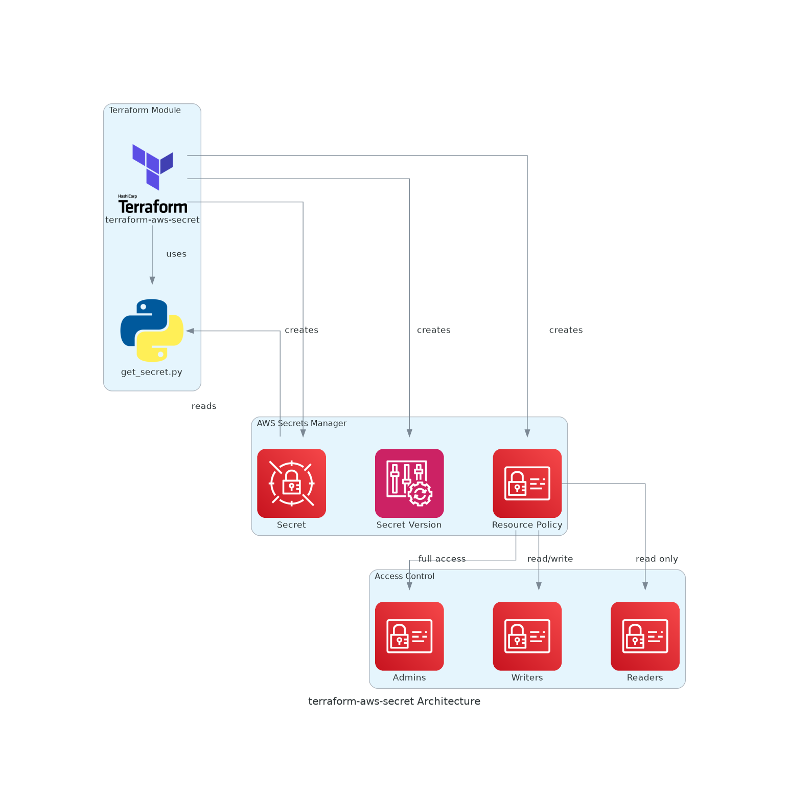
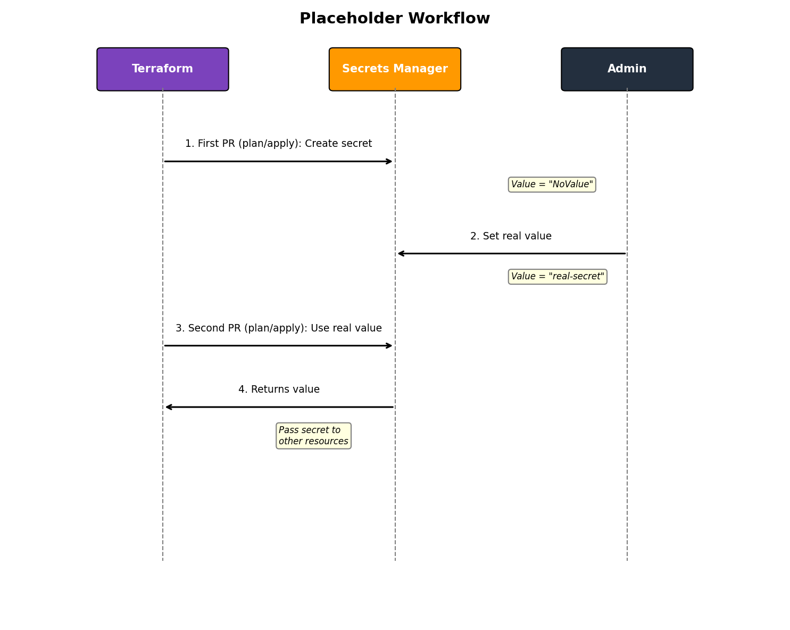

# Architecture

This page explains how terraform-aws-secret works internally.

## Overview



## Components

### Secret Resource

The module creates an `aws_secretsmanager_secret` resource with:

- Name or name prefix
- Description
- Resource-based IAM policy
- Tags for compliance and tracking

### Secret Version

The `aws_secretsmanager_secret_version` resource stores the actual secret value:

- When `secret_value` is provided: stores the value with `AWSCURRENT` stage
- When `secret_value` is null: stores placeholder "NoValue" with `INITIAL` stage

### Resource-Based Policy

The module generates a least-privilege IAM policy that:

- Grants full access to `admins`
- Grants read-only access to `readers`
- Grants read/write access to `writers`
- Supports wildcard ARNs for SSO roles

### External Data Source

A Python script (`assets/get_secret.py`) retrieves the current secret value:

- Returns the actual value if set externally
- Returns empty string for placeholder "NoValue"
- Terraform output converts empty string to `null`

## Access Control Model

### Permission Levels

| Role | GetSecretValue | PutSecretValue | DeleteSecret | DescribeSecret |
|------|----------------|----------------|--------------|----------------|
| Admin | Yes | Yes | Yes | Yes |
| Writer | Yes | Yes | No | Yes |
| Reader | Yes | No | No | Yes |

### Wildcard Support

The module supports wildcards in role ARNs for dynamic role matching:

```hcl
readers = [
  "arn:aws:iam::123456789012:role/AWSReservedSSO_Developers_*",
]
```

This is useful for AWS SSO roles where the suffix changes.

## Placeholder Workflow

When `secret_value` is null:

1. Module creates secret with "NoValue" placeholder
2. Administrator sets real value via AWS Console/CLI
3. Next `terraform apply` reads and outputs the real value
4. Terraform does not overwrite externally-set values



## Tags

The module applies these tags automatically:

| Tag | Value |
|-----|-------|
| `owner` | Caller role ARN (or `var.owner`) |
| `environment` | From `var.environment` |
| `service` | From `var.service_name` |
| `account` | AWS account ID |
| `created_by_module` | `infrahouse/secret/aws` |
| `module_version` | Current module version |