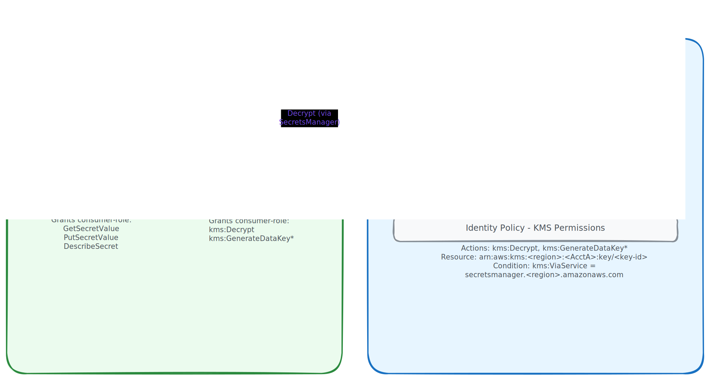

# Cross-Account Secret Access

This guide explains how to share a secret from one AWS account (the **owner**) with
a role in another AWS account (the **consumer**).

## Overview



Cross-account secret access requires three things to be true simultaneously:

1. **Resource policy** on the secret allows the consumer role (handled by this module
   when you add the consumer role ARN to `writers` or `readers`).
2. **KMS key policy** on a customer-managed key (CMK) allows the consumer role to
   decrypt. The module auto-creates this CMK when it detects cross-account role ARNs.
3. **Identity policy** on the consumer role in the consumer account grants
   `secretsmanager:GetSecretValue` and `kms:Decrypt` scoped to the owner account's
   resources.

## Accounts in This Guide

Throughout the examples below:

| Account                  | ID               | Role                              |
|--------------------------|------------------|-----------------------------------|
| **Owner** (Account A)    | `111111111111`   | Holds the secret and the CMK      |
| **Consumer** (Account B) | `222222222222`   | Accesses the secret cross-account |

## Owner Account Setup

The owner account (`111111111111`) creates the secret. Just add the consumer role
ARN to `writers` (or `readers`) — the module detects that the role belongs to a
different account and auto-creates a CMK with the right key policy:

```hcl
module "shared_secret" {
  source  = "registry.infrahouse.com/infrahouse/secret/aws"
  version = "1.1.1"

  secret_name        = "cross-account-config"
  secret_description = "Configuration shared with the consumer account"
  secret_value       = "super-secret-value"
  environment        = "production"
  service_name       = "shared-secret"

  writers = ["arn:aws:iam::222222222222:role/secret-consumer"]
}
```

That's it. The module:

- Detects that `222222222222` is not the current account
- Creates a CMK with a key policy granting the consumer role `kms:Decrypt`
  and `kms:GenerateDataKey*`
- Encrypts the secret with that CMK
- Generates a resource policy granting the consumer role read/write access

The CMK ARN is available via `module.shared_secret.kms_key_id` — the consumer
account needs it for scoping its identity policy.

!!! note "Bring your own CMK"
    If you need custom key policy settings, create a CMK separately and pass
    it via `kms_key_id`. The module skips auto-creation when `kms_key_id`
    is provided.

## Consumer Account Setup

The consumer account (`222222222222`) creates an IAM role with a trust policy
and an identity policy.

### Trust Policy

The trust policy controls who can assume the consumer role.

!!! warning "Replace the principal below with your own trusted role"
    The example trusts `secret-tester` from the owner account. Your trust
    policy must reference the principal that actually needs to assume this
    role — an EC2 instance role, a Lambda execution role, an SSO role, etc.

```json
{
  "Version": "2012-10-17",
  "Statement": [
    {
      "Effect": "Allow",
      "Principal": {
        "AWS": "arn:aws:iam::111111111111:role/secret-tester"
      },
      "Action": "sts:AssumeRole"
    }
  ]
}
```

### Identity Policy

The identity policy needs two statements: one for Secrets Manager, one for KMS.

```json
{
  "Version": "2012-10-17",
  "Statement": [
    {
      "Sid": "SecretRW",
      "Effect": "Allow",
      "Action": [
        "secretsmanager:PutSecretValue",
        "secretsmanager:GetSecretValue",
        "secretsmanager:DescribeSecret"
      ],
      "Resource": "arn:aws:secretsmanager:us-west-1:111111111111:secret:*"
    },
    {
      "Sid": "UseCmkViaSecretsManager",
      "Effect": "Allow",
      "Action": [
        "kms:GenerateDataKey",
        "kms:Encrypt",
        "kms:DescribeKey",
        "kms:Decrypt"
      ],
      "Resource": "*",
      "Condition": {
        "StringEquals": {
          "kms:ViaService": "secretsmanager.us-west-1.amazonaws.com"
        }
      }
    }
  ]
}
```

!!! note "Scope resources tightly"
    The example uses `secret:*` for brevity. In production, scope the
    Secrets Manager resource to the specific secret ARN if known at plan
    time.

!!! note "kms:ViaService condition"
    The `kms:ViaService` condition ensures the KMS key can only be used
    through Secrets Manager, not for arbitrary encrypt/decrypt operations.

## Access Pattern

Once both sides are deployed, the consumer role can access the secret:

=== "Python (infrahouse-core)"

    ```python
    from infrahouse_core.aws.secretsmanager import Secret

    secret = Secret(
        "arn:aws:secretsmanager:us-west-1:111111111111:secret:cross-account-config-AbCdEf",
        region="us-west-1",
        role_arn="arn:aws:iam::222222222222:role/secret-consumer",
    )

    # Read
    value = secret.value

    # Write
    secret.update("new-value")
    ```

=== "AWS CLI"

    ```bash
    # Assume the consumer role first
    eval $(aws sts assume-role \
      --role-arn arn:aws:iam::222222222222:role/secret-consumer \
      --role-session-name cross-account \
      --query 'Credentials.[AccessKeyId,SecretAccessKey,SessionToken]' \
      --output text \
      | awk '{printf "export AWS_ACCESS_KEY_ID=%s AWS_SECRET_ACCESS_KEY=%s AWS_SESSION_TOKEN=%s", $1, $2, $3}')

    # Read the secret by ARN (short names resolve against the caller's account)
    aws secretsmanager get-secret-value \
      --secret-id arn:aws:secretsmanager:us-west-1:111111111111:secret:cross-account-config-AbCdEf \
      --query SecretString --output text
    ```

!!! warning "Use the full ARN, not the short name"
    Cross-account callers **must** reference the secret by its full ARN.
    A short name like `cross-account-config` resolves against the caller's
    own account, not the owner account.

## Troubleshooting

### AccessDeniedException: no identity-based policy allows the action

The consumer role's identity policy is missing or doesn't cover the action.
Verify the policy is attached and the resource ARN matches:

```bash
aws iam get-role-policy \
  --role-name secret-consumer \
  --policy-name cross-account-secret-access
```

### AccessDeniedException: explicit deny in a resource-based policy

The consumer role ARN is not in the secret's `writers` or `readers` list.
Check the resource policy on the secret:

```bash
aws secretsmanager get-resource-policy --secret-id <secret-arn>
```

### KMS AccessDeniedException

The CMK key policy doesn't include the consumer role. If using the
auto-created CMK, check the key policy:

```bash
aws kms get-key-policy --key-id <key-arn> --policy-name default
```

### Stale reads after PutSecretValue

Cross-account reads may show the old value for a few seconds after a write
due to eventual consistency. Retry with a short delay if your workflow
requires read-after-write consistency.

## Complete Example

See [`test_data/secret_cmk/`](https://github.com/infrahouse/terraform-aws-secret/tree/main/test_data/secret_cmk)
for a working owner-side example with cross-account writer access.
